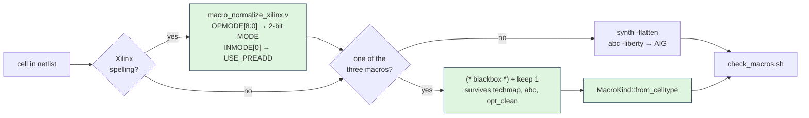

# The Big-GEM Theory

### Pool Shauryas
**Takneek 2026 • PS Zenith • Electronics Club, IIT Kanpur**

> Native `DSP48E2`, `CARRY4` and `SRLC32E` execution inside GEM's Boomerang engine, through a macro-preserving heterogeneous GPU execution pipeline.

A fork of [NVlabs/GEM](https://github.com/NVlabs/GEM) in which word-level FPGA primitives are **never shredded into Boolean logic**. They survive Yosys as first-class cells, are scheduled by a heterogeneous DAG, laid out in 64-bit aligned VRAM, and evaluated natively on the GPU ALU as `int64_t` arithmetic inside the Boomerang kernel.

---

## The Pipeline

```mermaid
flowchart LR
    A[SystemVerilog<br/>RTL] --> B[Yosys<br/>macro interception]
    B --> C[AIG build<br/>MacroBlock nodes]
    C --> D[Heterogeneous DAG<br/>avail / eval labels]
    D --> E[Partition +<br/>macro batching]
    E --> F[VRAM layout +<br/>script emission]
    F --> G[CUDA kernel<br/>Boomerang + macro phase]
    G --> H[Output VCD]

    style B fill:#dff5df,stroke:#1f3a5f
    style C fill:#dff5df,stroke:#1f3a5f
    style D fill:#dff5df,stroke:#1f3a5f
    style E fill:#dff5df,stroke:#1f3a5f
    style F fill:#dff5df,stroke:#1f3a5f
    style G fill:#dff5df,stroke:#1f3a5f
```



Green stages are new or substantially rewritten. GEM's Boomerang **reduction tree is unmodified** — the macro phase is inserted into the existing kernel between write-out settle and commit, so nothing about the Boolean fast path is disturbed.

**1,591 lines** of new host and device code.

---

## Verified at a Glance

| | Result | Evidence |
|---|---|---|
| **Macro models** | 14,552 vectors, **0 disagreements**; `CARRY4` covered **exhaustively** (all 1,024 inputs) | `csrc/tests/verify_macros.sh` |
| **Simulation correctness** | 4/4 ladder rungs pass, **32,800** port×timestamp comparisons each | `bench/verify_ladder.sh` |
| **Graph reduction** | AIG cells **85,444 → 5,754** (14.8×) at 16 lanes; 104× on `macro_smoke` | `synth/check_macros.sh` |
| **Per-cycle script** | **2,060 KiB → 454.5 KiB** (4.53×) — crosses the 1,536 KiB L2 boundary | `flatten.rs` log |
| **DRAM traffic** | **46.91 % → 0.04 %** of peak (1,173×) | Nsight Compute |
| **Register pressure** | 86 regs/thread, **0 bytes** spilled | `cuobjdump -res-usage` |

📄 **[Full technical report](docs/BigGEM_Project_Report.pdf)** — scheduling equations, memory architecture, verification methodology, complete numerical analysis.

---

## Why Not Shred?

GEM reduces every design to 1-bit AND-inverter form and re-reads its compiled instruction script from global memory **on every simulated cycle**. Shredding a word-level macro therefore does not cost you once — it costs you once *per cycle*, forever.

```
STANDARD GEM FLOW                          POOL SHAURYAS' FLOW
─────────────────────────                  ──────────────────────────
DSP48E2 / CARRY4 / SRLC32E                 DSP48E2 / CARRY4 / SRLC32E
          ↓                                          ↓
  techmap + abc -liberty                     blackbox + keep
          ↓                                          ↓
  ~9,900 AIG cells                           preserved as native macro
          ↓                                          ↓
  huge Boolean DAG                           compact heterogeneous DAG
          ↓                                          ↓
  2,060 KiB script                           454.5 KiB script
  re-read EVERY cycle                        fits in L2, fetched once
          ↓                                          ↓
  46.91 % of peak DRAM                       0.04 % of peak DRAM
```

> **Measured.** One `DSP48E2`, four `CARRY4` and one `SRLC32E` expand from **95 AIG cells to 9,922** — a factor of **104**. The architectural claim of this problem statement is that shredding inflates the graph by orders of magnitude; this is the number behind it.

---

## The Three Macros

Each is a `__host__ __device__ __forceinline__` model in `csrc/macros.cuh`, so **one source** serves both the CPU executor and the GPU kernel — the two cannot drift apart.

| Macro | Why preserving it matters | Native handling | Verification |
|---|---|---|---|
| **`DSP48E2`** | A 27×18 multiply-accumulate becomes thousands of AIG nodes and inflates graph *depth*, not just width | Pre-adder → 45-bit multiply → 48-bit ALU with 2-bit `MODE` mux, single `u64` of `PREG` state. Truncation at **27** bits in the pre-adder is modelled exactly | **1,648** vectors — 12 directed (signed extremes, both pre-adder paths, all 3 modes, the wrap case) + 400 random, each accumulated over 4 cycles so PREG feedback and 48-bit wrap are exercised |
| **`CARRY4`** | Carry chains are *serial*. Shredded, an n-bit adder becomes an n-deep Boolean cone; preserved, it is 4 bits of ripple in one ALU op | Stateless. `C[i+1] = (S[i] & C[i]) \| (~S[i] & DI[i])`, `O[i] = S[i] ^ C[i]`, packed as `CO \| (O << 4)` into one `u32` write-out slot | **1,024** vectors — **exhaustive** over the primitive's entire input space (2⁴ S × 2⁴ DI × 2 CIN × 2 CYINIT) |
| **`SRLC32E`** | A 32-deep shift register with a dynamic read port becomes 32 flip-flops plus a 32:1 mux tree | 32-bit SR in one `u64`. Combinational `Q = SR[A]`, `Q31 = SR[31]`; on the edge, `CE ? SR ← (SR << 1) \| D`. Follows GEM's read-old/commit-new discipline: `gem_srlc32e_read` runs **before** `gem_srlc32e_edge` | **11,880** vectors — 60 random start states × 6 shift steps × **all 32 addresses**, plus 360 edge vectors |

> **Design decision.** The problem statement's simplifications are honoured exactly: all input/internal registers combinational, only `PREG` clocked; `OVERFLOW`/`UNDERFLOW` pins ignored; all internal state initialises to zero, no `INIT` string parsing.

---

## A · Host Parser and Yosys Pre-Processor

Three blackboxes in `synth/gem_macros.v` — `$__GEMDSP_`, `$__GEMCARRY4_`, `$__GEMSRL32_` — are the **only** macro cell names that ever reach GEM's Rust netlist parser. The naming follows GEM's own convention for library macros (`$__RAMGEM_SYNC_`), so `src/aigpdk.rs:34` matches on these and never on Xilinx spellings.



**Two mechanisms, both necessary.** A blackbox has no body, so `synth -flatten` cannot inline it and `abc -liberty` treats the instance as a cone boundary exactly like a DFF. Separately, `setattr -set keep 1` stops `opt_clean -purge` from sweeping it as dead logic. Either one alone loses the macro.

**Port normalisation is the only file a hidden benchmark can touch.** `macro_normalize_xilinx.v` accepts the real Xilinx surface — `OPMODE[8:0]`, `INMODE[4:0]`, `ALUMODE[3:0]` — and reduces it to the 2-bit intent the kernel needs. The canonical names and widths downstream stay frozen.

**Two host-side invariants, established at parse time** (`MacroKind::from_celltype`, `src/aig.rs:393`):

- *Topological order by construction* — the DFS resolves a macro's combinational fan-in **before** allocating its output aigpin, so a macro output is always above its inputs. GEM's levelization assumes this; a macro that allocated its output first would silently break it for the whole design.
- *Ports addressed by canonical slot, not netlist iteration order* — `MacroBlock.in_iv` is indexed by `MacroKind::input_slot`, so `CARRY4` is always `S[0..3], DI[0..3], CIN, CYINIT` regardless of the order Yosys emitted pins.

> **Verification.** `synth/run_synth.sh` builds **both** flows from identical RTL, and `check_macros.sh` asserts the *opposite* condition in each: macros **present** in the native netlist, **absent** in the shredded one, exiting non-zero if a macro ever survives into the baseline. Without this the entire throughput comparison would be void while still producing plausible numbers.

---

## B · CUDA Execution Engine and Boomerang Modification

This is the core of the submission. The problem is not "run a multiplier on a GPU" — it is that a word-level macro **breaks GEM's central structural invariant**:

> *Every value inside a partition is produced by the AND-gate cover, and reaches its consumers through the Boomerang hierarchy.*

A macro output is produced by a separate evaluation phase, written into a separate buffer (`shared_writeouts`, not `shared_state`), on a separate schedule. A macro result therefore **cannot** become visible to Boolean logic inside the same partition — not in a later Boomerang stage, not under any batching order. The only ordering primitive with sufficient scope is the cooperative grid synchronisation between *major stages*, and the scheduling equations are built around that fact rather than around it.

### B.1 · Heterogeneous DAG scheduling

Two integer labels per node. They coincide everywhere except on combinational macro outputs, and **that single point of divergence is the entire content of the heterogeneous schedule**.

- `avail(v)` — the major stage in which `v` may be **read** by Boolean logic
- `eval(v)` — the major stage in which the producer of `v` is **executed**

Let `O_c` = aigpins driven by a *combinational* macro output (`CO`, `O`, `Q`, `Q31`), `O_s` = aigpins driven by a *clocked* macro output (`P`), and `combin(m)` = the combinational input pins of macro `m`:

```
(1)  avail(v) = 0                                   v ∈ {primary input, DFF Q, SRAM read, O_s}
(2)  avail(v) = max          avail(u)               v an AND gate
                u ∈ fanin(v)

(3)  eval(m)  = max          { eval(p)   if p ∈ O_c    m ∈ M
                p ∈ combin(m) { avail(p)  otherwise

(4)  avail(v) = eval(m) + 1                         v ∈ O_c driven by m
```

Four properties follow, and each one is load-bearing:

| | Property | Consequence |
|---|---|---|
| **P1** | Eq. (2) takes a **maximum, never an increment** | An arbitrarily deep cone of AND gates evaluates inside one major stage, exactly as in stock GEM. The Boomerang hierarchy is untouched. |
| **P2** | By eq. (1), a clocked macro output is a **level-0 leaf** | A DSP's `P` is read from global state like a DFF's `Q` — what a reader sees this cycle is last cycle's commit. Correct register semantics, **zero** synchronisation cost. |
| **P3** | Eq. (3) takes `eval`, not `avail`, of an operand that is itself a combinational macro output | **`CO[3] → CIN` chaining is free.** A `CARRY4` chain of any length resolves inside a *single* major stage. Without this case split a 64-bit carry-chain adder would demand 16 major stages. |
| **P4** | The `+1` in eq. (4) is charged **once**, and only where a combinational macro result crosses into the AND-gate domain | The minimum price consistent with the buffer separation above — and the only place this design pays for synchronisation. |

**Regression guarantee.** If `O_c = ∅` then `D = 0` by construction, and a macro-free netlist is scheduled **bit-identically to stock GEM**. This is what makes the baseline comparison meaningful rather than circular. Asserted by unit test `nothing_but_a_combinational_macro_can_raise_a_stage`.

**Measured instantiation** — `macro_bench.sv` at `LANES = 16` (16 `DSP48E2`, 64 `CARRY4` in 16 four-deep chains, 16 `SRLC32E`; 96 macros):

| Major stage | Contents | Partitions | Macro batches |
|---|---|---|---|
| 0 | 16 `DSP48E2` (endpoint), 64 `CARRY4`, 16 `SRLC32E` | 2 | 5 |
| 1 | Boolean cones consuming macro results | 1 | 0 |

The 64 chained `CARRY4`s occupy **four batches within one major stage**, not four stages. That is P3 doing the work it exists for: charging a major stage per chain link would have cost this design three additional grid barriers, worth ≈ 93 µs per simulated cycle at the rate measured in §D.

### B.2 · Macro-to-macro dependency handling

Within a batch, macros are mutually independent **by construction**: `pe.rs` computes the `ready` set against `realized_inputs` *before* updating it, so a chained consumer can never share a batch with its producer. Ordering is therefore required *between* batches, not within one — one batch is emitted per chain link, separated by `__syncthreads()`.


> **Design decision — block scope, not warp scope.** The problem statement names `__shfl_sync()` as an example warp-level primitive. We state precisely what is and is not done. `__shfl_down_sync` **is** present in the shipped kernel at five sites (the Boomerang tree's intra-warp reduction and the SRAM/duplicate permutation gather) and is preserved unchanged. The *macro phase itself* deliberately does not use a warp shuffle for its own ordering, because a batch can exceed 32 macros — **64 `CARRY4` in one partition at 16 lanes** — so the fence must be block-scope. A warp shuffle cannot express that ordering.

### B.3 · Heterogeneous memory allocator

The organising principle is **lifetime, not macro identity**.

| Lives in | What | Why |
|---|---|---|
| **Global (VRAM)** | `macro_word_state` — `UVec<u64>`, warp-padded per kind | State that must survive to the next simulated cycle: DSP `PREG`, SRLC32E shift register |
| **Shared (per SM)** | `shared_writeouts` — the macro block | Operands and results consumed within the cycle that produced them; no global round-trip |
| **Registers** | Gathered operands, `int64` arithmetic | 86 regs/thread, **0 bytes spilled** |

A `CARRY4` is stateless and therefore **never touches global memory at all**.

- **64-bit alignment holds structurally, not by assertion.** The region is declared `UVec<u64>`: the element type supplies 8-byte alignment and `cudaMalloc` a 256-byte aligned base. Instances are grouped by kind, each kind beginning on a warp boundary, so a type-homogeneous batch reads a **contiguous, segment-aligned span** — the condition for coalesced access.
- **No atomics, by construction.** Macro instance *i* receives `ceil(|outputs(i)| / 32)` contiguous `u32` slots, so no two macros can contend for the same word. The device-side result scatter is a plain read-modify-write. This falls out of the allocation, not from a lock-free argument.
- **Write-out region ordering is a correctness requirement.** The region is laid out `normal ‖ macro ‖ duplicate ‖ SRAM`. The kernel locates the duplicate block by subtracting from the *top* of the region, so inserting the macro block between the duplicates and the SRAMs would silently displace every duplicate. Placing it below restores the invariant the kernel already assumes — **two lines in `flatten.rs`, and no kernel change**, which matters directly against the register budget.
- **Script-side indirection.** A batch record references macros by index into the layout's slot table rather than inlining descriptors: `[stage index | kind code | count | count × slot index]`. A DSP descriptor alone is 176 words; inlining would dwarf the script it lives in.

### B.4 · The macro phase inside the kernel

`csrc/kernel_v1_impl.cuh:305–437`. It runs **after** Boolean write-outs have settled in `shared_writeouts` and **before** they are committed to `output_state` — so the existing commit path carries macro results out and the clock-enable machinery applies unchanged.

```mermaid
flowchart LR
    A["Boomerang stages<br/>__shfl_down_sync reduction"] --> B["__syncthreads()"]
    B --> C["load num_macro_batches<br/>shared_metadata[8]"]
    C --> D["for each batch:<br/>CSR descriptor lookup"]
    D --> E["gather operands<br/>GEM_RD_BIT, sentinels"]
    E --> F["dispatch by kind<br/>gem_dsp48e2 / gem_carry4 / gem_srlc32e"]
    F --> G["scatter result<br/>read-modify-write, no atomics"]
    G --> H["__syncthreads()<br/>orders next chain link"]
    H -->|more batches| D
    H --> I["commit write-outs<br/>→ output_state"]
    I --> J["this_grid().sync()"]

    style C fill:#dff5df,stroke:#1f3a5f
    style D fill:#dff5df,stroke:#1f3a5f
    style E fill:#dff5df,stroke:#1f3a5f
    style F fill:#dff5df,stroke:#1f3a5f
    style G fill:#dff5df,stroke:#1f3a5f
    style J fill:#fde8ec,stroke:#1f3a5f
```



**Warp uniformity.** Batches are **type-homogeneous** — `pe.rs:31` groups `ready` macros by `MacroKind` before emitting a `MacroBatch`. Every active lane in a batch therefore takes the same `switch` arm; the warp does not diverge *across kinds*. It does diverge across *occupancy* (a batch of 16 macros leaves 16 of 32 lanes idle), and §D measures exactly that rather than glossing it.

**Cost of the phase, in the kernel's own terms:** 130 lines inside the existing kernel, **no atomics**, **no additional registers beyond 86**, every warp-level primitive GEM already used preserved. Its one cost is the grid barrier the scheduling equations require — and that cost is measured, not estimated.

---

## Verification

Correctness was not established with one end-to-end waveform diff. It is a **layered stack**, and each layer isolates a different failure mode, so a disagreement names the layer that caused it.

| # | Layer | What is checked | Evidence |
|---|---|---|---|
| 1 | **Macro models** | C++ device models vs an independent Python transcription of the PS equations, over an identical vector set | **14,552** vectors, **0 disagreements** — `CARRY4` exhaustive (1,024), `DSP48E2` 1,648, `SRLC32E` 11,880 · `verify_macros.sh` |
| 2 | **Synthesis / parser** | Macros **present** in the native netlist and **absent** in the shredded one; non-zero exit if a macro leaks into the baseline | `check_macros.sh` on both flows |
| 3 | **Structural** | Rust port tables agree with `gem_macros.v`; a macro-free netlist still schedules bit-identically to stock GEM | `canonical_order_tests`, `nothing_but_a_combinational_macro_can_raise_a_stage` |
| 4 | **Boolean GPU path** (rung 1) | Shredded GPU run vs `naive_sim` CPU ground truth | **32,800** port×timestamp comparisons — **Pass** |
| 5 | **Design equivalence** (rung 2) | Shredded netlist vs macro-preserving netlist, **both on CPU** | **32,800** — **Pass** |
| 6 | **Macro GPU path** (rung 3) | Native GPU run vs `naive_sim` CPU ground truth | **32,800** — **Pass** |
| 7 | **Host/kernel bisect** (rung 4) | The *compiled script* executed on CPU (`flatten_test`) vs ground truth | **32,800** — **Pass** |
| 8 | **Regression** | Full ladder on `macro_smoke` | **49,200** comparisons — **Pass** |
| 9 | **Benchmark-time** | Refuses to run against a stale binary; re-maps both flows before every ladder run | `bench/env.sh`, `verify_ladder.sh` |

**Why rung 2 exists.** No GPU-only comparison can establish that the two netlists are the *same design*. Rung 2 compares the shredded and macro-preserving netlists on the CPU, before a GPU is involved — it is the only rung that can separate a synthesis defect from an execution defect.

**Why rung 4 exists.** `flatten_test` executes the same compiled script on the CPU, so it shares the host compiler (`staging.rs`, `pe.rs`, `flatten.rs`) with the GPU but none of the kernel:

```
rung 3 fails, rung 4 fails  →  host: scheduling, placement or script encoding
rung 3 fails, rung 4 passes →  kernel: indexing, fencing or a race
rung 2 fails                →  synthesis
```

**On oracle independence.** The macro-model check (layer 1) is genuinely cross-implementation: `dump_vectors.cpp` emits from the CUDA models, `reference_model.py` computes the same set from the PS equations, and the two share only the LCG that generates random inputs. `naive_sim` (layers 4–8) is independent of the *GPU execution path* — no script, no partitioning, no Boomerang scheduling — but shares the netlist with the thing it validates, which is exactly why layer 2 exists separately. GEM's own `--check-with-cpu` is **not** treated as an oracle for the macro path, because it consumes the same mapped script and would agree with the kernel about bits neither is computing.

**A structural invariant this work established.** GEM fetches Boomerang script sections with widened vector loads (`VectorRead4`), requiring section offsets to be a multiple of four `u32` words. Stock GEM satisfies this without ever stating it, because every stock section length is a multiple of four. A macro batch record is `3 + count` words — the first variable-length element ever added to the stream — so an even count breaks alignment for **every partition that follows it**. The emitter now pads at emission. The general rule, worth recording for anyone extending a GPU instruction stream: *any variable-length section consumed by widened loads must preserve the widest load's alignment.*

---

## D · Benchmarks and Performance Analysis

### Methodology

| | |
|---|---|
| **Device** | NVIDIA RTX 3050 6 GB Laptop, `sm_86`, 20 SMs, **1,536 KiB L2**, 131.7 GB/s peak (read via `cudaGetDeviceProperties`, not a spec sheet) |
| **Benchmark** | `bench/macro_bench.sv`, lane-parameterised. At `LANES = 16`: 16 `DSP48E2`, 64 `CARRY4` in 16 four-deep `CO[3]→CIN` chains, 16 `SRLC32E`, plus Boolean logic consuming their results |
| **Baseline** | **The same codebase** with macros shredded to AIG by the frontend — i.e. what stock GEM does to this design. Asserted macro-free by `check_macros.sh` |
| **Controls** | Identical stimulus, identical `num_blocks = 40`, identical 400 cycles, identical binary, on both sides |
| **Statistic** | 5 repetitions per point, **median** reported (a laptop GPU clocks down under sustained load, so the distribution has a long right tail) |
| **Timer** | GEM's own `simulation` span, which brackets the kernel launches and **excludes** netlist parsing, mapping and VCD writing |

### Measured — front-end

| Design | Flow | AIG cells | DFFs | Macros | Partitions |
|---|---|---|---|---|---|
| `macro_smoke` | shredded | 9,922 | 133 | 0 | 1 |
| | preserved | **95** | 8 | 7 | 1 |
| `macro_bench` (16) | shredded | 85,444 | 1,600 | 0 | 6 |
| | preserved | **5,754** | 768 | 96 | 2 + 1 |

The DFF counts move for a reason worth naming: a DSP's `P` and an SRLC32E's shift register become **macro word state** rather than Boolean flip-flops, so they leave the Boomerang's endpoint set entirely.

### Measured — throughput and script size

| Lanes | Baseline (cyc/s) | Native (cyc/s) | Ratio | Script (shred) | Script (native) | Reduction |
|---:|---:|---:|:---:|---:|---:|---:|
| 8 | 24,852 | 11,637 | 0.47× | 1,336.0 KiB | 292.3 KiB | 4.57× |
| 16 | 22,426 | 13,657 | **0.61×** | 2,060.0 KiB | 454.5 KiB | 4.53× |
| 32 | 17,991 | — | — | 3,830.0 KiB | — | — |

Two things are visible immediately, and neither is visible from a single measurement: the native path is **flat** in lane count while the baseline **degrades**, so the ratio *climbs* (0.47 → 0.61). The 32-lane native point is absent because a write-out budgeting defect blocked the mapping; that fix landed after this sweep and re-measurement was not performed in time.

### Measured — Nsight Compute

200 cycles, `num_blocks = 40`, `LANES = 16`. The cooperative launch **requires** `--replay-mode application`: default per-pass kernel replay re-executes the kernel in isolation, which a `this_grid().sync()` cannot survive.

| Metric | Baseline | Native | Reading |
|---|---:|---:|---|
| `dram__throughput` (% peak) | 46.91 | **0.04** | bandwidth-bound → not bandwidth-bound |
| `sm__warps_active` (% peak) | 33.33 | 33.33 | occupancy **identical** |
| `smsp__thread_inst_executed` | 28.91 | 19.78 | of 32 — the divergence trade |
| Local ld/st sectors | 0 | 0 | nothing spills |
| `gpu__time_duration` (200 cyc) | 7.51 ms | 15.06 ms | +37.75 µs/cycle |

### Analysis — why the GPU behaves this way

**The script reduction is not a linear bandwidth saving; it is a residency transition.** A 4.53× smaller script produced a 1,173× traffic reduction, and no linear argument yields that gap. The mechanism is L2 capacity:

| | Script | vs 1,536 KiB L2 | Behaviour |
|---|---:|:---:|---|
| Baseline | 2,060.0 KiB | 1.34× | **Does not fit** — re-fetched from DRAM every cycle |
| Native | 454.5 KiB | 0.30× | **Fits** — fetched once, then cache-resident |

Two arithmetic checks confirm the reading. *The baseline's DRAM traffic is essentially all script*: 46.91 % of 131.7 GB/s is 61.8 GB/s, while script re-reads alone account for 2,109,440 B × 200 / 7.51 ms = 56.2 GB/s — **91 % of everything measured**. The instruction script is not a contributor to the bottleneck; it *is* the bottleneck. *The native script is fetched approximately once, not two hundred times*: at 0.04 % of peak over 15.06 ms, total DRAM traffic is ≈ 0.8 MB against a script of 0.465 MB. Re-reading it every cycle would move 93 MB.

The consequence is a sharper design rule than "make the script smaller": **the benefit has a cliff at the L2 capacity.** A reduction that does not carry the script across that line buys proportional bandwidth; the one that crosses it buys three orders of magnitude.

**So why is wall clock still below the baseline?** Because wall clock is a *sum* of costs, and three of the four candidate terms are eliminated by measurement rather than by argument:

| Candidate cause | What was measured | Verdict |
|---|---|---|
| Memory bandwidth | DRAM 46.91 % → 0.04 % of peak | **Eliminated** — traffic fell 1,173× |
| Register spilling | local ld/st = 0 sectors; `STACK:0 LOCAL:0` statically | **Eliminated** — nothing spills |
| Occupancy loss | `sm__warps_active` = 33.33 % in **both** configurations | **Eliminated** — residency identical; the partition-collapse hypothesis is refuted |
| Warp divergence | 28.91 → 19.78 of 32 threads/instruction | **Real, but secondary** — a small term of a 15.06 ms kernel |
| **Grid synchronisation** | 1 barrier/cycle → **2** | **Dominant** |

After those eliminations the extra grid barrier is the only structural difference between the two configurations that any measured quantity distinguishes — and two independent instruments size it consistently: **37.75 µs/cycle** from Nsight over 200 cycles, **31.1 µs/cycle** from wall clock over 400. Different tools, different run lengths, agreeing to within 20 %.

> **Measured result.** The macro-preserving path is **synchronisation-bound** — not memory-bound, not occupancy-bound, not spill-bound. Its memory cost is 1,173× lower than the baseline's and its residency is bit-identical; it pays one additional grid-wide barrier per simulated cycle, worth 31–38 µs, which at these scales exceeds the bandwidth it saves.

The divergence figure deserves its own sentence, because it is a *deliberate trade rather than a defect*: the Boomerang tree is perfectly uniform, so the baseline keeps 28.91 of 32 lanes busy; a macro batch activates one lane per macro. Idle arithmetic lanes were bought in exchange for memory traffic — and the DRAM row shows the purchase went through in full. The trade is only worth making when the baseline was genuinely bandwidth-bound, and at 46.91 % of peak it was.

### Projected — not measured

> Fitting the baseline points gives ≈ 32 µs/cycle fixed plus script bytes at ≈ 165 GB/s marginal, which places the crossover near a **7 MB shredded script** — beyond 32 lanes, whose script is 3,830 KiB. This is an extrapolation from two intervals and is labelled as one. It is **not** a performance claim.

### Engineering evolution

```
integration          →  profiler diagnosis      →  identified fix
─────────────────       ────────────────────       ──────────────
macro path runs         eliminate bandwidth,       collapse eq. (4):
correct, script         spilling, occupancy        inject macro results into
4.53× smaller,          against measured data;     the Boomerang level-1 input
DRAM −1,173×,           barrier isolated and       set within the same
wall clock 0.61×        sized twice (37.75 /       partition → one barrier
                        31.1 µs/cycle)             per cycle instead of two
```

The optimisation target follows *from the equations*, not from guesswork: eq. (4) charges `+1` major stage exactly where a combinational macro output enters the Boolean domain, and the profiler measures that stage at 31–38 µs/cycle. A faster macro phase, a better memory layout and reduced divergence are all past the point of diminishing return; the stage boundary is the only term left that is worth attacking.

> **Not implemented, and no performance claim depends on it.** The level-1 overlay replaces the mechanism the entire schedule is built on and would require the full verification ladder to be re-run. It was scoped and deliberately not attempted in the time available, because shipping it unverified would have been worse than shipping a measured result.

<!-- ─────────────────────────────────────────────────────────────────
     POST-OPTIMISATION RE-MEASUREMENT — paste here once re-run.
     Keep the same controls (same GPU, num_blocks, cycles, 5 reps,
     median, and a passing verify_ladder.sh at that configuration),
     otherwise the comparison is void.

     | Lanes | Baseline | Native | Ratio |
     |---:|---:|---:|:---:|
     | 16 |  |  |  |
     | 32 |  |  |  |

     Regenerate with:
        bash bench/sweep.sh 8 16 32 64
        FLAT=1 TOP=macro_bench SHRED=build_bench16_shred \
            NATIVE=build_bench16_native bash bench/verify_ladder.sh
     ───────────────────────────────────────────────────────────── -->

---

## Reproducing

Requires Rust, Python 3, a CUDA Toolkit matching your GPU (**≥ 12.8** for Blackwell / `sm_120` such as an RTX 5060), and Yosys ≥ 0.68 — the last is fetched automatically if missing.

```bash
git clone --recursive <repo-url> && cd GEM
bash judge_run.sh bench/macro_bench.sv macro_bench      # Linux
```

```bat
compile.bat bench\macro_bench.sv macro_bench            :: Windows, via WSL2
```

Either entry point builds, synthesises the design **both ways**, maps, runs the full correctness ladder, measures throughput and attempts an Nsight Compute profile, writing everything to `judge_results/`. Point it at any SystemVerilog design and top module; a stimulus VCD is generated if none is supplied.

Individual stages:

```bash
source bench/env.sh && gem_build            # sets CUDA_LIBRARY_PATH + gencode; fails on a stale binary
bash bench/gen_bench.sh 16                  # synthesise both flows at 16 lanes
FLAT=1 TOP=macro_bench SHRED=build_bench16_shred \
    NATIVE=build_bench16_native bash bench/verify_ladder.sh
bash bench/sweep.sh 8 16 32 64              # throughput across scales → bench/sweep_results.csv
sudo -E TOP=macro_bench SHRED=build_bench16_shred \
    NATIVE=build_bench16_native bash bench/profile.sh
```

> `bench/env.sh` exists because two environment mistakes silently derailed three measurement runs on this project: `find_cuda_helper` ignores `CUDA_PATH` on Linux, and `required-features = ["cuda"]` makes Cargo **skip** `cuda_test` silently, exit 0 — so a plain `cargo build --release` relinks everything except the one target that needs CUDA and the next benchmark measures a stale kernel while looking perfectly healthy. Both are now impossible to hit from a fresh terminal.

---

## Where the Code Lives

| Component | Path |
|---|---|
| Yosys interception, normalisation, both flows | `synth/gem_macros.v`, `macro_normalize_xilinx.v`, `step{1,2}_*.ys`, `check_macros.sh` |
| Macro recognition, canonical slots | `src/aig.rs:393` |
| Heterogeneous scheduling equations | `src/staging.rs` |
| Macro batching, chain ordering | `src/pe.rs:31`, `pe.rs:751` |
| VRAM layout, script emission | `src/flatten.rs`, `src/macro_layout.rs:131` |
| Boomerang kernel + macro phase | `csrc/kernel_v1_impl.cuh:305–437` |
| Cycle-accurate macro models | `csrc/macros.cuh` |
| CPU reference models, vector harness | `src/bin/naive_sim.rs`, `flatten_test.rs`, `csrc/tests/` |
| Verification ladder, benchmarks, profiling | `bench/verify_ladder.sh`, `throughput.sh`, `sweep.sh`, `profile.sh` |
| Technical report | `docs/BigGEM_Project_Report.pdf` |

---

## PS Zenith Coverage

| Requirement | Implementation | Evidence |
|---|---|---|
| **A — Host Parser & Yosys Pre-Processor (15)** | | |
| Intercept named `DSP48E2` / `CARRY4` / `SRLC32E` | 3 blackboxes in `synth/gem_macros.v`; `macro_normalize_xilinx.v` maps the real Xilinx port surface | Macros present in native netlist |
| Prevent techmap / ABC flattening into the AIG | `(* blackbox *)` + `setattr -set keep 1` in `step2_logic.ys` | `check_macros.sh` asserts both directions |
| Yosys 0.68 / SystemVerilog JSON compatibility | `write_json` in both flows; `setup_yosys.sh` pins ≥ 0.68 | Consumed by `check_macros.sh` |
| Map intercepted nodes into flattened 64-bit aligned buffers | `MacroLayout::build`, `UVec<u64>`, warp-padded per kind | Alignment holds structurally; 458-word descriptor total checked |
| **B — CUDA Engine & Boomerang Modification (35)** | | |
| Modified levelized DAG scheduling equations | Eq. (1)–(4) in `src/staging.rs`, with properties P1–P4 | `nothing_but_a_combinational_macro_can_raise_a_stage` |
| Mixed-width scheduling without stalling warps | Type-homogeneous `MacroBatch` (`pe.rs:31`) | `smsp__thread_inst_executed` measured, not assumed |
| `CO[3] → CIN` ordering **without** intermediate Boolean nodes | One batch per chain link; `ready` vs `realized_inputs` (`pe.rs:751`); P3 | 64 chained `CARRY4` in **one** major stage, 5 batches |
| Native evaluation on the GPU ALU via `int64_t` | `kernel_v1_impl.cuh:305–437`; `gem_dsp48e2`, `gem_carry4`, `gem_srlc32e` | Ladder rung 3, 32,800 comparisons |
| Shared memory + warp-level primitives | `shared_writeouts` hosts macro operands; `__shfl_down_sync` preserved at 5 sites; `__syncthreads()` orders chains | 3,328 B/block; 0 spill |
| **C — Hardware Macro Implementations (20)** | | |
| `DSP48E2` subset, PREG-only clocked | `gem_dsp48e2`, `csrc/macros.cuh` | 1,648 vectors, 0 disagreements |
| `CARRY4` exact silicon logic | `gem_carry4`, `macros.cuh:132` | **1,024 vectors — exhaustive** |
| `SRLC32E` clock-edge semantics | `gem_srlc32e_read` / `_edge`, read-old/commit-new | 11,880 vectors, 0 disagreements |
| Own behavioural verification (no golden reference supplied) | `reference_model.py` + `dump_vectors.cpp` + `verify_macros.sh` | 14,552 total; cross-language |
| **D — Benchmarks & Performance Analysis (20)** | | |
| Throughput vs unmodified GEM, simulated cycles/s | `bench/throughput.sh`, `bench/sweep.sh`, identical controls both sides | Sweep table above; `bench/sweep_results.csv` |
| Memory bandwidth utilisation (Nsight Compute) | `bench/profile.sh`, `--replay-mode application` | 46.91 % → 0.04 % of peak |
| Warp divergence metrics (Nsight Compute) | `smsp__thread_inst_executed_per_inst_executed` | 28.91 → 19.78 of 32 |
| **E — Documentation & Reports (10)** | | |
| Mathematical definition of the modified scheduling equations | Eq. (1)–(7) with P1–P4 and the regression guarantee | Report §5 |
| Architectural block diagrams (Global / Shared / Registers) | Primitive→hierarchy map, write-out ordering, kernel flow | Report §6–7 |
| Extensive numerical analysis of throughput | Residency-cliff analysis, elimination table, two-instrument attribution | Report §10 |

---

### Credits

**Pool Shauryas** — Harshita Bharti · Lavanya Prakash · Aditi · Aaahana Mehrotra · Gauri Singh · Soundarya Murugaiyan · Dharshini S · Swadha Singh · Ashritha Aryapu

Built on **GEM** — Guo, Zhang, Wang, Lin and Ren, *GEM: GPU-Accelerated Emulator-Inspired RTL Simulation*, DAC 2025, NVIDIA Research. Upstream licence retained; see `LICENSE`.
